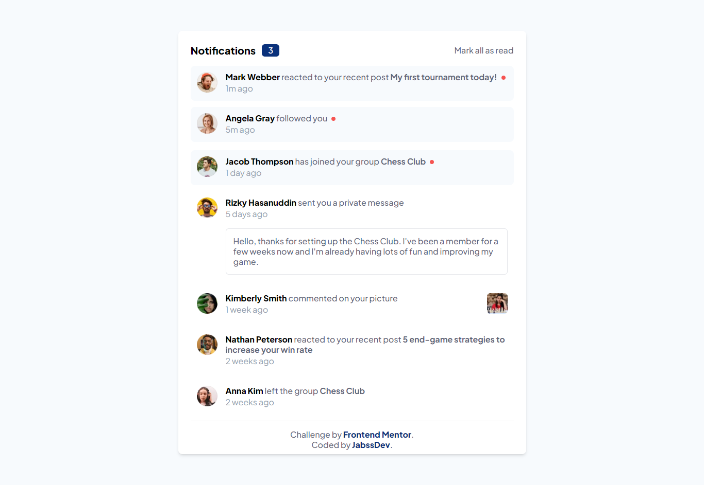

# Frontend Mentor - Notifications page solution

This is a solution to the [Notifications page challenge on Frontend Mentor](https://www.frontendmentor.io/challenges/notifications-page-DqK5QAmKbC). Frontend Mentor challenges help you improve your coding skills by building realistic projects.

## Table of contents

- [Overview](#overview)
  - [The challenge](#the-challenge)
  - [Screenshot](#screenshot)
  - [Links](#links)
- [My process](#my-process)
  - [Built with](#built-with)
  - [What I learned](#what-i-learned)
  - [Continued development](#continued-development)
- [Author](#author)

## Overview

This project involves developing a user interface that displays a notification center. The goal is to build the page respecting good HTML, CSS, Tailwind and JavaScript practices, ensuring that it is fully functional and responsive, i.e. that it adapts perfectly to different screen sizes, from mobile devices to desktops.

### The challenge

Users should be able to:

- Distinguish between "unread" and "read" notifications
- Select "Mark all as read" to toggle the visual state of the unread notifications and set the number of unread messages to zero
- View the optimal layout for the interface depending on their device's screen size
- See hover and focus states for all interactive elements on the page

### Screenshot



### Links

- Solution URL: [Add solution URL here](https://your-solution-url.com)
- Live Site URL: [Add live site URL here](https://your-live-site-url.com)

## My process

### Built with

- Semantic HTML5 markup
- CSS custom properties
- Flexbox
- CSS Grid
- Mobile-first workflow
- DOM Manipulation
- [Tailwind](https://tailwindcss.com/) - CSS Framework

### What I learned

This was my first project done with Tailwind, I learned how to handle the directives, functionalities and custom styles that this framework offers. I also learned how to handle the 'DOMContentLoaded' event to update the number of unread notifications when the page loads.

```css
@layer base {
	@font-face {
		font-family: "Plus Jakarta Sans";
		...;
	}
}
@layer components {
	.notification-active {
		@apply ...;
	}

	.not-read {
		@apply ...;
	}
}
```

```js
theme: {
		extend: {
			fontFamily: {
				sans: ["Plus Jakarta Sans", "sans-serif"],
			},
			colors: {
				primary: {
					...
				},
				secundary: {
					...
				},
			},
		},
	},
```

```js
document.addEventListener("DOMContentLoaded", updateNotificationCounter);
```

### Continued development

In the near future I would like to learn how to handle custom styles fluently and combine Tailwind with a React, Vue or Angular project. I also want to master the concepts of grids and animations. Finally, I want to learn how to use the Sass and Less processing languages.

## Author

- Frontend Mentor - [@jabssdev](https://www.frontendmentor.io/profile/jabssdev)
- Twitter - [@10bsJordan](https://x.com/10bsJordan)
- Linkedin - [@jabssdev](https://www.linkedin.com/in/jabssdev/)
